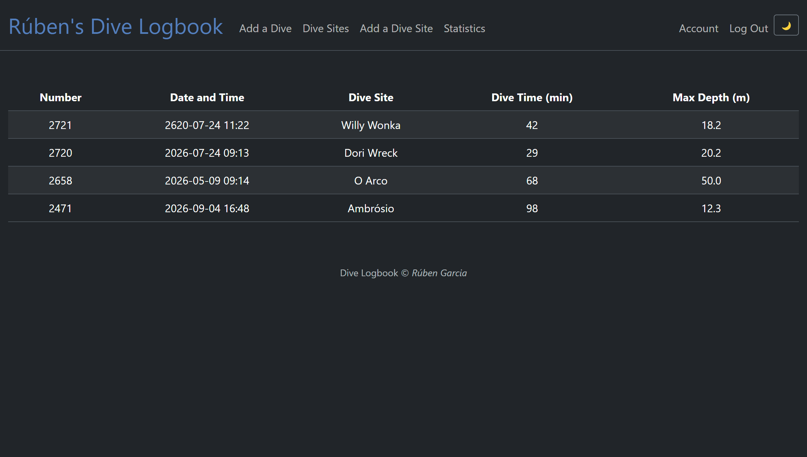
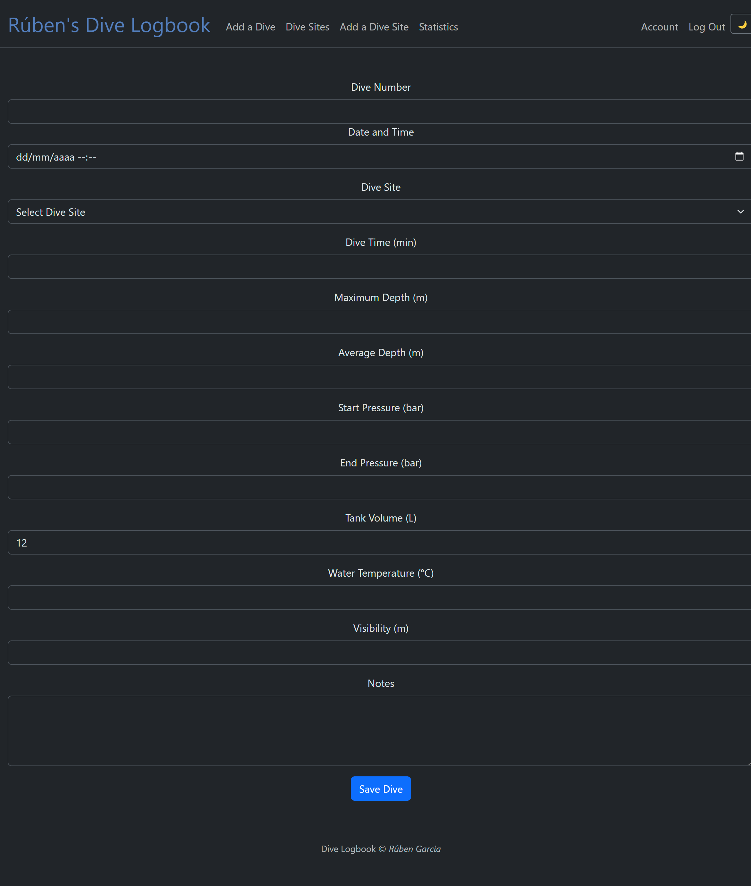
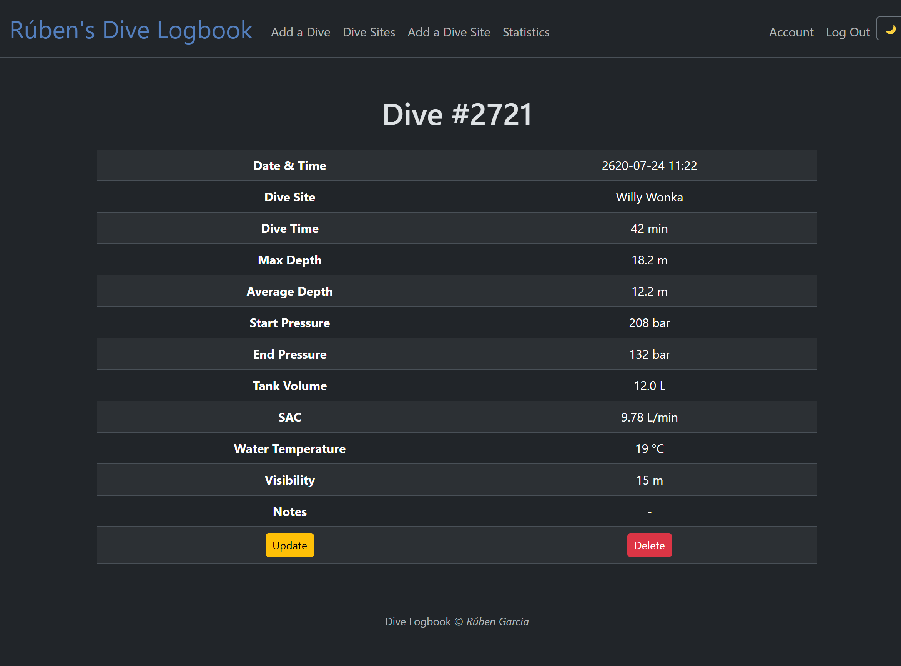
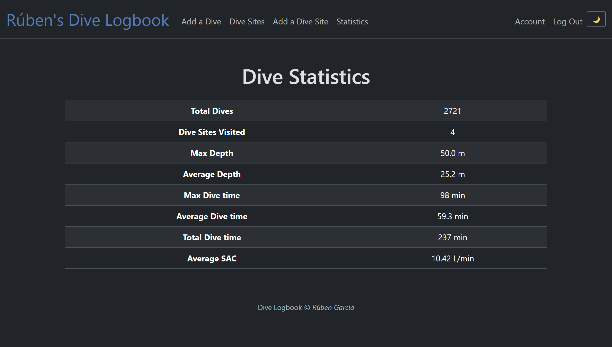
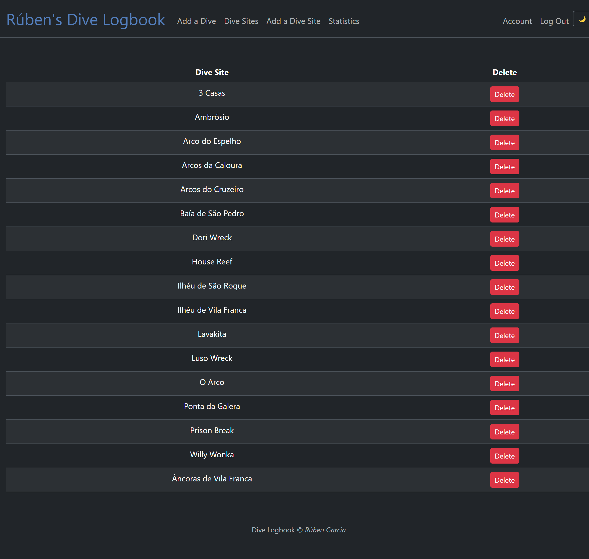
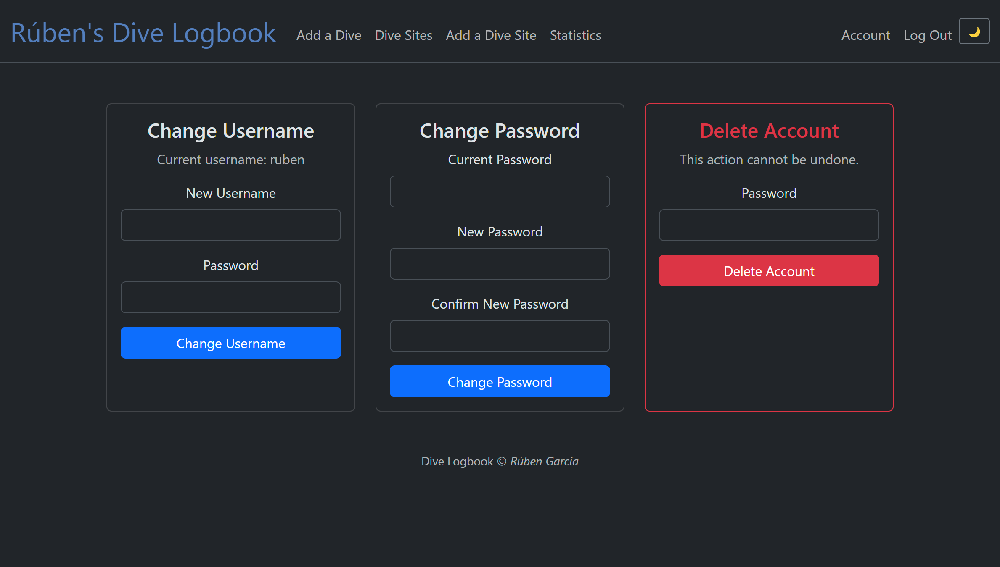

# Dive Logbook

A multi-user web application that allows scuba divers to record, manage and analyse their diving activities online.

Developed as the Final Project for Harvard University's CS50x course.

#### Video Demo: <[CS50x Final Project](https://youtu.be/c06j2tab1YQ)>

## Screenshots

### Logbook Overview



### Add New Dive



### Dive Details



### Statistics Dashboard



### Dive Site Management



### Account



## Technologies Used

### Backend
- Python
- Flask
- SQLite
- CS50 SQL Library

### Frontend
- HTML
- CSS
- Bootstrap 5
- Jinja2

### Development Tools
- Git
- Black

## Key Features

- Multi-user authentication
- Dive logging and management
- Dive site management
- Statistics dashboard
- Light & Dark Mode
- Mobile-friendly design
- Account management
- SQLite relational database
- User-specific data protection


## Description

Dive Logbook is a web application built with **Flask** that allows scuba divers to maintain and manage their personal dive logbooks online.

The project was inspired by and built upon multiple CS50 projects. The original database design was first developed during my **CS50SQL** final project, then expanded into a command-line application for my **CS50P** final project. This version represents the next evolution of the project: a complete multi-user web application inspired by the structure and design patterns used in the **CS50 Finance Problem Set**.

The application allows divers to create personal accounts, log dives, manage dive sites, review detailed dive information, and view statistics about their diving activity. By moving from a command-line interface to a web interface, the project became significantly more user-friendly and accessible.

The goal of the project is to provide a simple and customizable dive logging solution without relying on commercial dive logging software.

The application also includes support for both Light Mode and Dark Mode themes, allowing users to choose the interface style that best suits their preferences and viewing conditions. The selected theme is preserved across pages, providing a consistent user experience throughout the application.

---

## Why I Built This Project

As a Scuba Instructor , I regularly maintain a dive logbook to record my dives and track my diving experience.

My original command-line application worked well, but it was limited to a single user and required interaction through the terminal. I wanted to continue improving the project by creating a modern web-based version that:

- Supports multiple users
- Allows secure authentication
- Provides a more intuitive user interface
- Makes dive information easier to browse and update
- Better reflects real-world web application development

This project allowed me to combine my passion for diving with the web development skills learned throughout CS50.

---

## Features

### User Interface

The application includes:

- Responsive Bootstrap-based design
- Light Mode and Dark Mode themes
- Mobile-friendly layouts
- Clickable dive entries
- Flash messages for user feedback
- Consistent form validation
- Dedicated account management page

The interface automatically adapts to different screen sizes, making the application usable on desktop computers, tablets, and mobile devices.

### User Accounts

Users can:

- Register for a new account
- Log in securely
- Log out
- Change their username
- Change their password
- Delete their account

Passwords are stored securely using password hashing.

Each user's dives and statistics are completely isolated from other users.

---

### Dive Logging

Users can:

- Add new dives
- View all dives in their logbook
- View detailed information about a specific dive
- Update existing dives
- Delete dives

The home page displays a simplified logbook view containing:

- Dive Number
- Date and Time
- Dive Site
- Dive Time
- Maximum Depth

Each row in the logbook can be selected to open a detailed view of the dive.

The detailed dive page displays all available information about the dive, including depths, pressure information, SAC rate, visibility, water temperature, and notes. Users can also update or delete dives directly from this page.

Authorization checks ensure that users can only view, update, and delete their own dives.

---

### Dive Site Management

Users can:

- View all available dive sites
- Add new dive sites
- Delete unused dive sites

Dive sites are stored independently from dives and referenced through foreign keys.

To maintain data consistency, dive site names are validated case-insensitively, preventing duplicates such as:

```text
Dori Wreck
dori wreck
DORI WRECK
```

from existing simultaneously.

---

### Statistics

Each user has access to a personal statistics dashboard.

Statistics include:

- Total dives logged
- Number of dive sites visited
- Maximum depth
- Average depth
- Longest dive
- Average dive duration
- Total accumulated dive time
- Average SAC rate

Statistics are calculated from the currently logged-in user's dive history.

---

## Database Design

The application uses SQLite as its database backend.

The database contains three primary tables.

### users

Stores user account information.

Attributes:

- id
- name
- username
- hash

Passwords are never stored in plain text.

---

### divesites

Stores dive site locations.

Attributes:

- id
- divesite

Each dive site is stored only once and can be referenced by many dives.

---

### logs

Stores information about individual dives.

Attributes:

- id
- user_id
- number
- datetime
- divesite_id
- dive_time
- max_depth
- av_depth
- start_pressure
- end_pressure
- volume
- sac
- water_temp
- visibility
- notes

Each dive belongs to one user and one dive site.

The table uses foreign key constraints to maintain referential integrity.

---

## Database Relationships

```text
users
   |
   | 1 : N
   |
logs
   |
   | N : 1
   |
divesites
```

A user can have many dives.

A dive site can have many associated dives.

When a user account is deleted, all associated dives are automatically removed through cascading deletes.

---

## Database Views

To simplify common queries, the application uses SQLite views.

### logbook

Provides a complete, human-readable representation of a dive by joining dive and dive site information.

Used when displaying detailed dive information.

---

### stats

Aggregates dive information for each user.

Includes:

- Total dives
- Dive sites visited
- Maximum depth
- Average depth
- Maximum dive time
- Average dive time
- Total dive time
- Average SAC rate

---

## SAC Calculation

Surface Air Consumption (SAC) is calculated by the Flask application before a dive is saved in the database.

The formula used is:

```text
((start_pressure - end_pressure) × volume)
------------------------------------------------
((average_depth / 10 + 1) × dive_time)
```

The resulting value is rounded to two decimal places.

---

## Security Features

Several security measures have been implemented throughout the application:

- Authentication required for all dive-related pages
- Password hashing using Werkzeug
- Session-based authentication
- Authorization checks before viewing or modifying dives
- Authorization checks before updating or deleting account information
- Case-insensitive username validation
- Case-insensitive dive site validation
- Foreign key constraints for data integrity

Users can never access another user's dive records by manipulating URLs or form submissions.

---

## Design Choices

### Why Flask?

Flask was selected because it is lightweight, flexible, and perfectly suited for small and medium-sized web applications.

It allowed me to expand my original command-line project into a complete web application while continuing to use Python for all business logic.

---

### Why Base the Project on CS50 Finance?

The overall structure of the project was inspired by the CS50 Finance Problem Set.

Several concepts from Finance were reused and adapted, including:

- User registration
- User authentication
- Session management
- Login-required routes
- Flash messages
- Flask templates
- SQLite integration

Building upon the Finance architecture allowed me to focus on implementing dive-specific functionality rather than recreating common web application patterns from scratch.

---

### Why Multi-User Support?

The original command-line version was designed for personal use.

Moving to a web application naturally introduced the possibility of supporting multiple divers. Each user now maintains an independent dive logbook, allowing the application to be used by friends and colleagues.

---

### Why Store Dive Sites Separately?

Many dives take place at the same location.

By storing dive sites in a separate table, the database avoids unnecessary duplication and remains properly normalized.

This also simplifies future updates and maintenance.

---

### Why Use Views?

Views provide reusable representations of common queries and reduce complexity within the Flask routes.

Using views helps keep the application logic cleaner and easier to maintain.

---

### Why SQLite?

SQLite was retained because it:

- Requires no server configuration
- Is lightweight
- Is easy to distribute
- Works well for small and medium-sized projects
- Integrates seamlessly with Flask

Although SQLite is sufficient for this project, migrating to PostgreSQL would be straightforward if additional scalability became necessary.

---

### Why Light and Dark Mode?

Divers may use the application in a variety of environments, including bright outdoor conditions before dives and low-light conditions during travel or dive planning.

Providing both Light Mode and Dark Mode improves accessibility and user comfort while giving users the ability to personalize their experience.

---

## User Interface Improvements

Compared to the command-line version, the web application introduces several usability improvements:

- Responsive Bootstrap-based interface
- Light Mode and Dark Mode themes
- Clickable dive entries
- Detailed dive pages
- Forms with validation
- Account management page
- Statistics dashboard
- Mobile-friendly layout
- Navigation menu for all major features
- Flash messages providing immediate user feedback

These improvements make the application significantly more accessible and user-friendly than the original command-line version while maintaining all of the original functionality.

---

## Project Structure

```text
project/
│
├── app.py
├── helpers.py
├── logbook.db
│
├── templates/
│   ├── layout.html
│   ├── index.html
│   ├── dive.html
│   ├── add_dive.html
│   ├── update_dive.html
│   ├── dive_sites.html
│   ├── add_dive_site.html
│   ├── stats.html
│   ├── login.html
│   ├── register.html
│   └── account.html
│
├── static/
│   ├── styles.css
│   └── favicon.ico
│
├── requirements.txt
└── README.md
```

---

## Technologies Used

- Python
- Flask
- Black
- SQLite
- HTML
- CSS
- Bootstrap 5
- Jinja2
- Werkzeug
- CS50 SQL Library

---

## Code Formatting

The project's Python source code was formatted using **Black**.

Formatted files include:

- `app.py`
- `helpers.py`

Using Black ensures consistent code style, improves readability, and makes the project easier to maintain.

---

## Installation

Clone the repository:
```text
git clone https://github.com/rubenjmgarcia/dive-logbook.git
```

Install dependencies:
```text
pip install -r requirements.txt
```

Run:
```text
flask run
```

---

## Author

**Rúben Garcia**

CS50x Final Project
